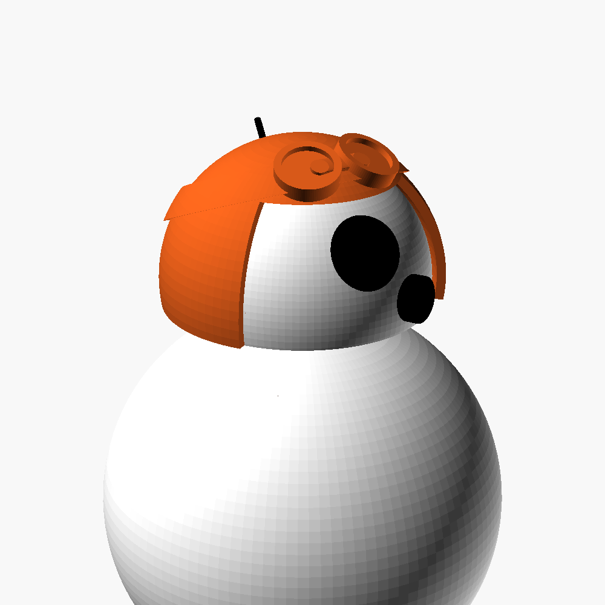
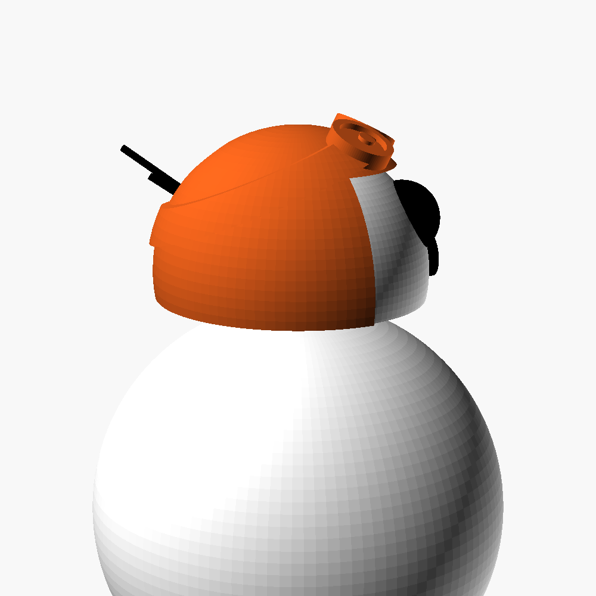
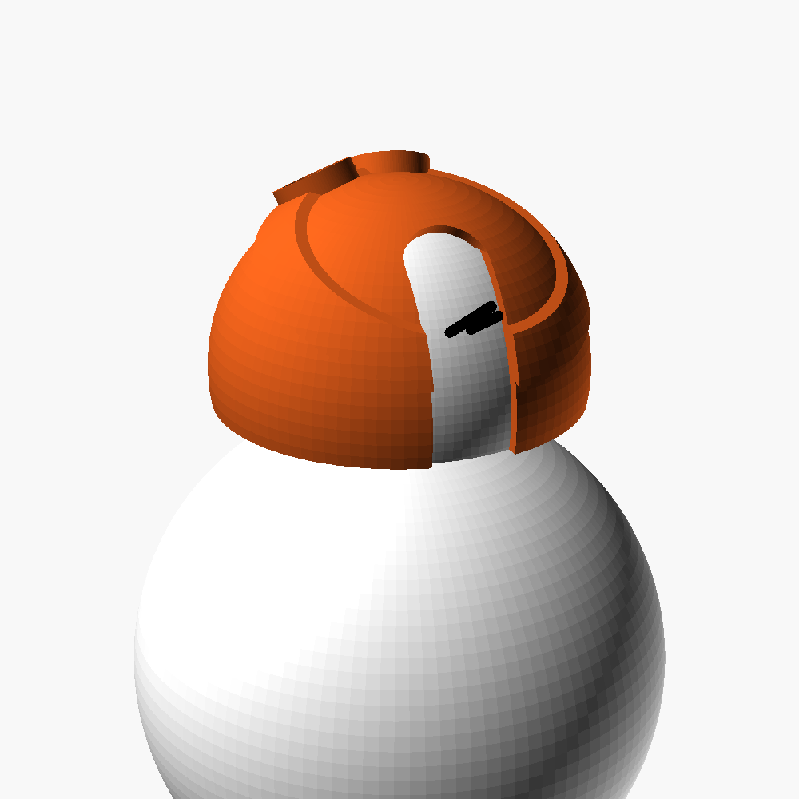
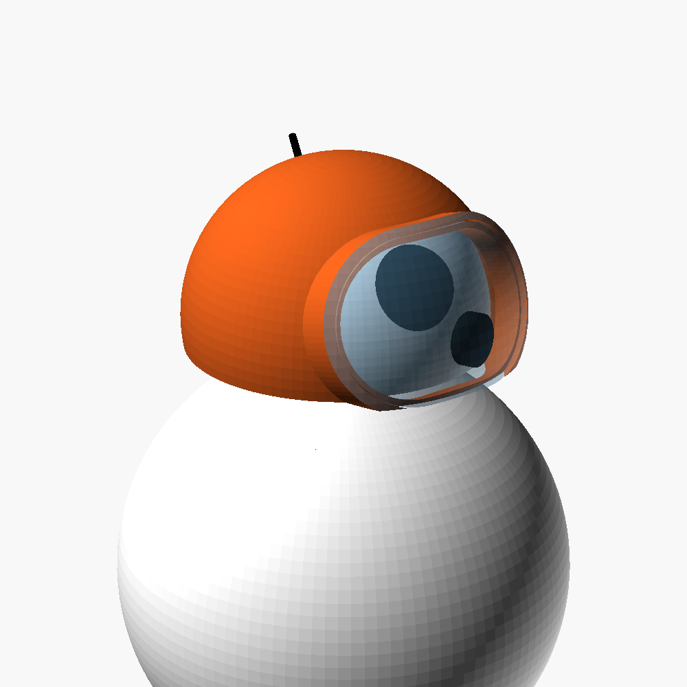
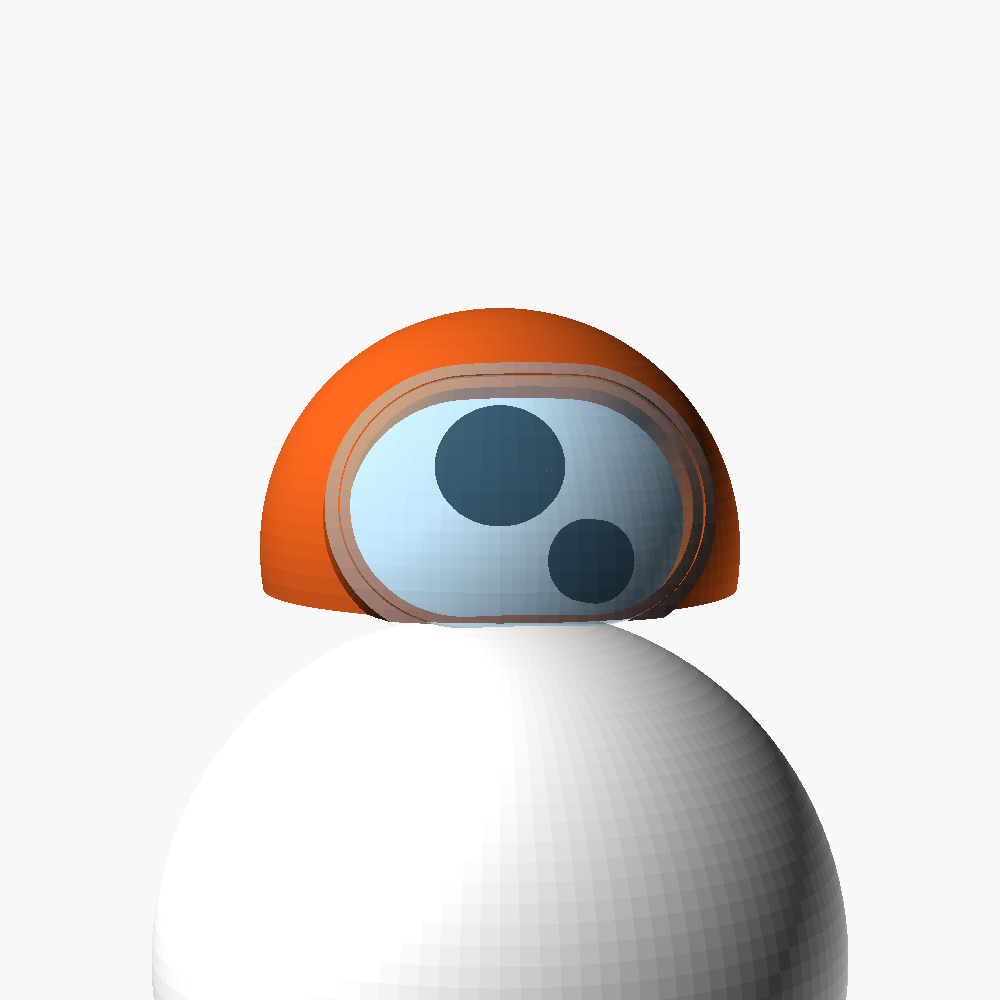
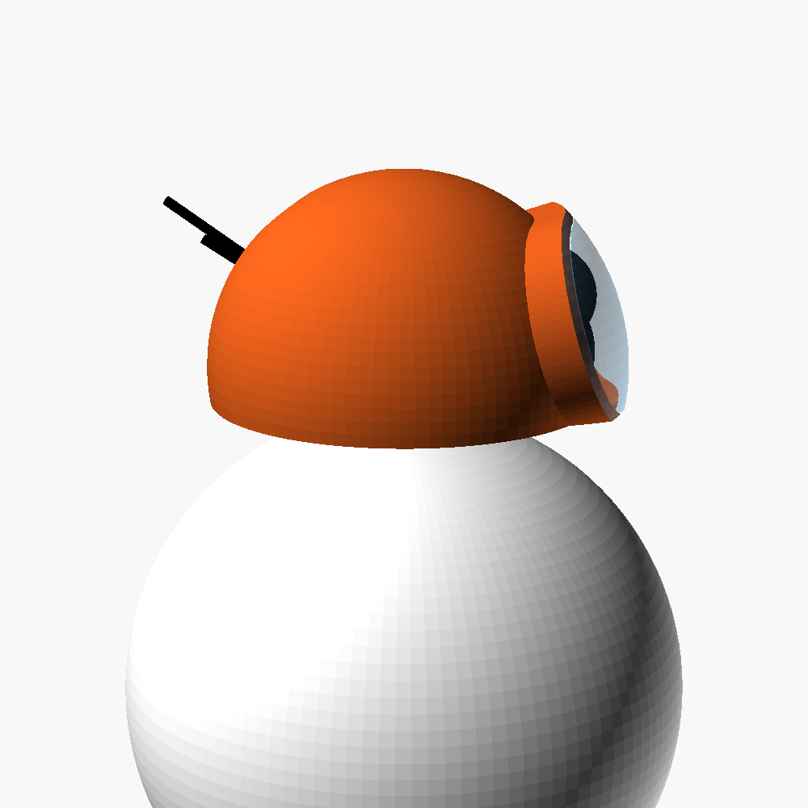
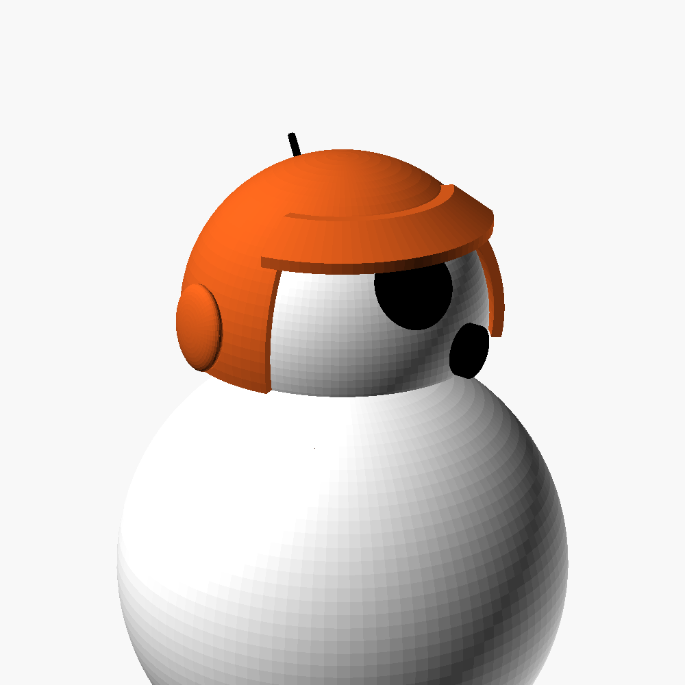
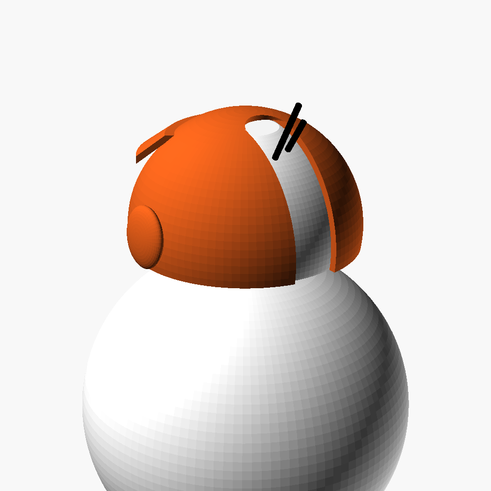
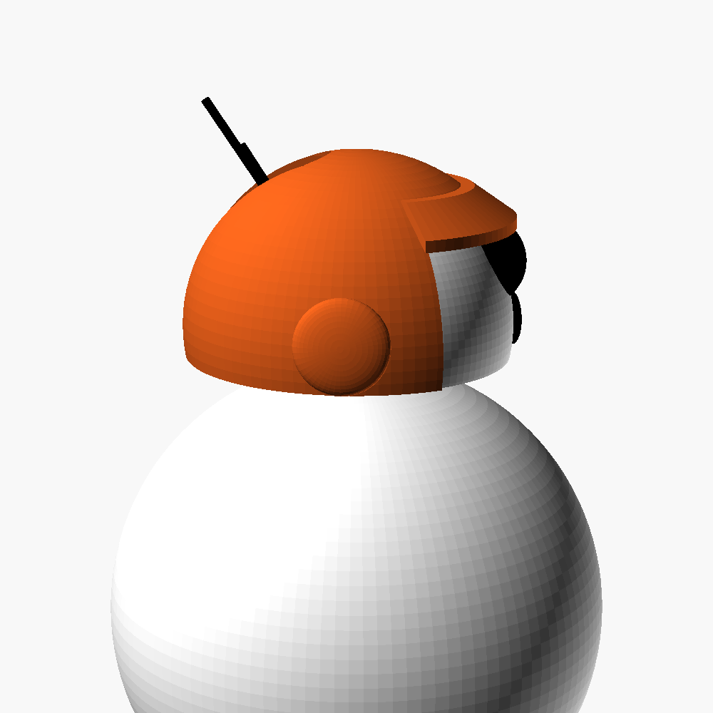

# Helmets for the Sphero BB-8

Three 3D-printable helmets that drop over the head of the Sphero BB-8 (model
R001), sharing one shell. Parametric OpenSCAD, ready-to-slice STLs, and a set
of fit-test rings so the one number nobody publishes, the head diameter, can
be measured on the real droid before a helmet is printed.

**Goggles-up helmet** (`bb8_goggles_up_helmet.scad`): open face, with a pair
of round goggles pushed up onto the forehead, Copilot style, and their strap
running round the back of the helmet. The lens floors are recessed inside
the frames: paint them dark, or do a colour swap at that layer.

| Front | Side | Rear |
|---|---|---|
|  |  |  |

**Goggle helmet** (`bb8_goggle_helmet.scad`): a smooth closed dome with one
wide, thick-rimmed goggle window across the face, after the GitHub Copilot
mark. Both the big eye and the small lens show through the single window.
An optional clear lens seats in the bezel.

| Front | Straight on | Side |
|---|---|---|
|  |  |  |

**Pilot helmet** (`bb8_pilot_helmet.scad`): Rebel-pilot style, open face,
drooping visor peak, side comm-pods.

| Front | Rear (antenna slot) | Side |
|---|---|---|
|  |  |  |

## Files

| File | What it is |
|---|---|
| `bb8_dimensions.scad` | Every droid measurement, plus a mock head and body used by the previews |
| `helmet_common.scad` | The shell, antenna slot and grip bumps shared by both helmets, with their parameters |
| `bb8_goggles_up_helmet.scad` | The goggles-up helmet; goggle and strap parameters at the top |
| `bb8_goggle_helmet.scad` | The goggle helmet; window and bezel parameters at the top |
| `goggle_lens.scad` | The clear lens for the goggle helmet, laid out for printing |
| `bb8_pilot_helmet.scad` | The pilot helmet; face, visor and pod parameters at the top |
| `fit_rings.scad` | Six rings, 43 to 48 mm, to find the real head diameter |
| `head_reference.scad` | The mock head alone, printable as a stand-in for test fitting |
| `assembly.scad`, `assembly_goggle.scad`, `assembly_goggles_up.scad` | Preview only: each helmet on head on body |
| `stl/` | Exported meshes, watertight, millimetres |
| `preview/` | Renders of the above |
| `Makefile` | `make` regenerates `stl/` and `preview/` from the sources |

## The droid's dimensions

Sphero publishes only the outer envelope. The head is derived, and the
derivation is written next to each number in `bb8_dimensions.scad`.

| Measurement | Value | Source |
|---|---|---|
| Overall height, antenna included | 114 mm | Sphero tech specs (via [Sphero Wiki](https://sphero.fandom.com/wiki/Sphero_BB8), [Gadget Flow](https://thegadgetflow.com/product/sphero-bb-8-ultimate-star-wars-droid/)) |
| Width, i.e. ball diameter | 73 mm | Same |
| Weight, whole droid | ~200 g | Same |
| Head dome sphere diameter | **45 mm, estimated** | Movie ratio 0.58 ([rimstar.org](https://rimstar.org/science_electronics_projects/bb-8_dimensions.htm)) gives 42; the supplied photo gives ~0.62 after perspective, 45 |
| Head height, rim to crown | **27 mm, estimated** | 114 − 73 ball − 2 air gap − ~12 antenna above the crown |
| Head rim diameter | 44.1 mm, derived | From the two figures above; the rim sits below the equator |
| Antennas | Two, a close pair ~16 mm and ~8 mm, elevation ~30°, 12 to 15° left of dead rear | Plan-view and rear photos of the bare head |

The two bold figures are ±2 mm guesses and they set the fit. That is what
`fit_rings.scad` is for. Older reviews quote 70 mm for the ball and 90 mm
overall ([Impulse Gamer](https://www.impulsegamer.com/bb-8-droid-by-sphero-the-review/));
Sphero's own 73 / 114 mm figures are used here.

## Print order

1. **Print `stl/fit_rings.stl`** (flat, 5 minutes). Drop each ring over the
   crown of the head. The smallest ring that slides past the widest part of
   the dome, which is just above the silver rim, is the real head diameter plus
   clearance.
2. **Set `head_d`** in `bb8_dimensions.scad` to that ring's inner diameter
   minus 0.5 mm. If the head is clearly taller or shorter than 27 mm from the
   silver rim to the top, set `head_h` too.
3. **Export the helmet**: `make stl`, or open the helmet file in OpenSCAD and
   press F6 then export.
4. **Print the helmet** rim-down, open side on the bed.
5. **Goggle lens, optional**: print `stl/goggle_lens.stl` in transparent
   PETG, dome up, 0.1 mm layers, 100% infill, slow, with supports under the
   dome. It drops into the rebate in the bezel with 0.15 mm of play; a dab of
   clear glue holds it. The bezel stands 3.5 mm proud so the lens clears the
   big eye, which sticks about 4 mm out of the head. Leave the window open if
   you would rather see the eye directly.

The slot is centred on the antenna pair (`slot_az`, 167°), not on the rear
centre line, because the pair sits to the left of it. If the antennas foul
the slot, widen `slot_w` (default 11 mm) or swing `slot_az`. To fit the head into the helmet, go in
face-first with the head tilted back so the antennas ride up the slot, then
level it. The head lifts off the ball, which makes this easier than doing it in
place.

## Print settings

| Setting | Value |
|---|---|
| Material | PLA or PETG; the helmets weigh 6.7 to 7.3 g in PLA, the clear lens ~1 g |
| Layer height | 0.12 to 0.16 mm |
| Perimeters | 4 (the 1.6 mm wall is all perimeter, no infill) |
| Supports | None needed for any of the helmets. The goggles-up frames and strap stand at most 2.2 mm proud. The visor peak droops at 35°, the comm-pods are domed, and the goggle bezel's underside arc is only 2.4 mm wide. The last few millimetres of the crown are steep; a brim and slow cooling handle it, or add a small tree support if your printer struggles |
| Orientation | Rim down |

The head is held on the ball by magnets and balances on wheels, so keep the
helmet light and centred. The default shell is 1.6 mm; 1.2 mm with 3
perimeters also works and saves 1.5 g.

## Retention

Four 0.3 mm bumps just inside the rim give a light friction grip on the glossy
head (`grip_bumps`). If the helmet still slides when the droid corners, a pea
of Blu Tack at the crown works and leaves no mark; set `grip_bumps = false`
if the fit is already tight.

## Parameters

Shared, in `helmet_common.scad`:

| Parameter | Default | Meaning |
|---|---|---|
| `clearance` | 0.8 | Radial air gap between head and shell |
| `wall` | 1.6 | Shell thickness |
| `edge_lift` | 0.5 | Helmet edge stops this far above the silver rim |
| `slot_az`, `slot_w`, `slot_top_el` | 167°, 11 mm, 50° | Antenna slot centre line, width, and how far up the back it runs |
| `grip_bumps`, `bump_h` | true, 0.3 | Friction bumps inside the rim |

Goggle helmet, in `bb8_goggle_helmet.scad`:

| Parameter | Default | Meaning |
|---|---|---|
| `win_w`, `win_h` | 33 mm, 22 mm | Window size across and up the face |
| `win_el`, `win_az` | 17°, 6° | Window centre; nudged toward the small lens |
| `bezel_w`, `bezel_h` | 2.4 mm, 3.5 mm | Frame width and height above the shell |
| `lens_t`, `lens_lip`, `lens_gap` | 1.0, 1.0, 0.15 mm | Lens thickness, overlap into the bezel, play |

Goggles-up helmet, in `bb8_goggles_up_helmet.scad`:

| Parameter | Default | Meaning |
|---|---|---|
| `face_half_az`, `face_top_z` | 56°, 18.5 | Face opening, as for the pilot helmet |
| `goggle_el`, `lens_az` | 62°, ±28° | Where the two lenses sit on the forehead |
| `lens_od`, `lens_id`, `frame_h`, `floor_h` | 11, 8.5, 2.2, 1.2 mm | Lens frame size, height, and recessed floor |
| `strap_w`, `strap_h`, `strap_tilt` | 5 mm, 1 mm, 22° | Strap band width, height, and how far it drops toward the back |

Pilot helmet, in `bb8_pilot_helmet.scad`:

| Parameter | Default | Meaning |
|---|---|---|
| `face_half_az` | 58° | Half-width of the face opening |
| `face_top_z` | 18.5 | Brow line height above the head's sphere centre; must clear the big eye |
| `visor_len`, `visor_droop` | 6 mm, 35° | Peak size and downward angle |
| `pod_d`, `pod_proud` | 13 mm, 1.8 mm | Side comm-pods |

Coordinates: origin at the centre of the sphere the head is cut from, +Z up,
+X toward the big eye. Azimuth 0 is the front, 180 the back.
